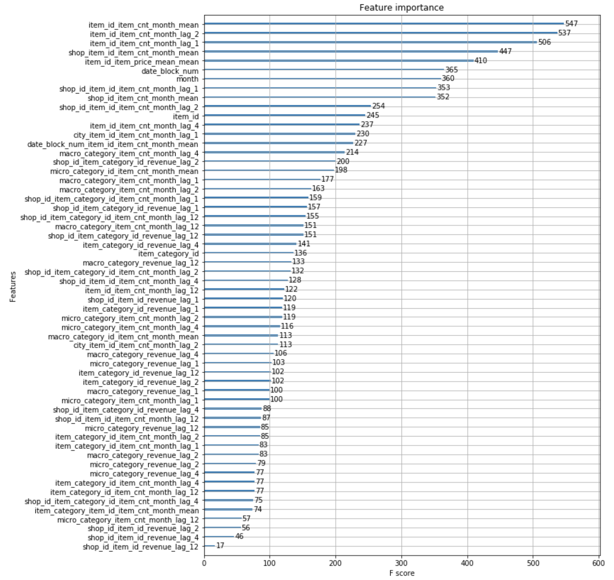

### Predict Future Sales - Competition
### Table of Contents

1. [Installation](#installation)
2. [Project Description](#description)
3. [File Descriptions](#files)
4. [Results](#results)
5. [Licensing, Authors, and Acknowledgements](#licensing)

## Installation 

I used Anaconda Package with Python version 3.7 to create this notebook with the following libraries Pandas, NumPy, Matplotlib, Scikit-Learn. Addidtionaly, the notebook requires NLTK library. 
run: conda install nltk 

I used MacBook Pro with the following specifications:
macOS Mojave Version 10.14
Processor 2.3 GHz Intel Core i5
Memory 16GB 2133MHz LPDDR3

python 3.7.1
numpy 1.15.4
pandas 0.23.4
sklearn 0.20.1
xgboost 0.81
nltk 3.3

## Project Description

This notebook serves as final project for the "How to win a data science competition" Coursera course. This challenge is also posted on [kaggle.com](https://www.kaggle.com/c/competitive-data-science-predict-future-sales).
In this competition I worked with a challenging time-series dataset consisting of daily sales data, kindly provided by the largest Russian software firms - 1C Company. The goal is to predict total sales for every product and store in the next month. The list of shops and products slightly changes every month. Creating a robust model that can handle such situations is part of the challenge.

## File Descriptions 
The following files were provided for analysis:  
data/sales_train.csv - the training set. Daily historical data from January 2013 to October 2015.   
data/test.csv - the test set. I need to forecast the sales for these shops and products for November 2015. 
data/sample_submission.csv - a sample submission file in the correct format. 
data/items.csv - supplemental information about the items/products. 
data/item_categories.csv - supplemental information about the items categories. 
data/shops.csv- supplemental information about the shops.

Data fields: 
ID - an Id that represents a (Shop, Item) tuple within the test set. 
shop_id - unique identifier of a shop.   
item_id - unique identifier of a product.   
item_category_id - unique identifier of item category.  
item_cnt_day - number of products sold. This is a target field that needs to be predicted for a monthly period of time. 
item_price - current price of an item date - date in format dd/mm/yyyy.  
date_block_num - a consecutive month number, used for convenience. January 2013 is 0, February 2013 is 1,..., October 2015 is 33. 
item_name - name of item. 
shop_name - name of shop.  
item_category_name - name of item category. 

helper.py - the python module with helper functions. 
future_sales.ipynb - python notebook that includes exploratory analysis, feature engineering, model selection and evaluation. 

## Results

Time-series dataset consists of daily sales of 1500 products in 60 stores.
This diagram represents a total number of items sold in selected stores during the whole period of time.

The box plot for each shop representing the total number of items sold is demonstrated below.

Training Method
The best solution was obtained using XGboost method trained on numerical features ((rmsd score=0.96). However, I also experimented with other models and stacking technique. I created data set using Natural Language Processing (NLP) technique and trained Stochastic Gradient Descent (SGD) Regressor model on this NLP features. The resulted score of 1.13 was higher than XGBoots method trained on numerical features. Then, I applied ensemble of these two methods: I created meta-feature using these two methods trained Random Forest Regressor on this new metadata. The resulted model score (1.12) improved SGD score but didn’t improve XGBoost score. 
The 5 most important features:
1.	The average amount of different items sold (item_id_item_cnt_month_mean)
2.	The number of different items sold two months ago (item_id_item_cnt_month_lag2)
3.	The number of different items sold one month ago (item_id_item_cnt_month_lag1)
4.	The average amount of different items sold in different shops (shop_item_id_item_cnt_month_mean)
5.	The average price of different items (item_id_item_price_mean_mean)

Feature importance obtained using XGboost plot_importance method

Interesting Findings
I tried to engineer different lag and mean encoded features. Interestingly, mean price lag encoded features decreased the performance of the model. So, for the final model I used lag encoded features that doesn’t include prices but include only number of items sold.

Model Execution Time
The model training takes 1.5 hour.
The model prediction takes less than 1 minute.

## Licensing, Authors, Acknowledgements
Thank you 1C-company for provided data and coursera instructors for great course.
